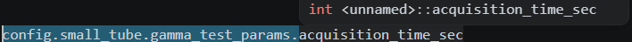

# C Best Practices and Info

- i nomi delle variabili e delle funzioni sono in formato ```snake_case```

- le struct si mettono nel file .h

- non è necessario creare una cartella models contente le struct: si mettono direttamente nel modulo

- ```char *[]``` è equivalente a ```char **```

- ```int``` numero intero con segno ```size_t``` intero senza segno

- ```exit(EXIT_FAILURE)``` termina l'intero programma da qualunque funzione venga chiamato, ```return EXIT_FAILURE``` termina il main
e restituisce l'errore al sistema operativo

- aggiunta di librerie esterne: #include "tomlc17.h" serve solo a rendere visibili dichiarazioni, tipi e funzioni. Non compila automaticamente l’implementazione. Occorre quindi compilare la libreria

- il compilatore trova la libreria tomlc17 senza importare il percorso esatto perchè il Makefile imposta questa opzione nel compilatore ```INCLUDES = -I lib/tomlc17``` che va a cercare gli header in ```lib/tomlc17/```

- ```*config = (Config){0};``` azzera tutti i campi della struct config (passata come parametro)

- Le include guard servono ad evitare che un certo modulo (un file header) venga incluso più volte nello stesso file compilato:
    ```c
        #ifndef <MODULE_NAME>_H
        #define <MODULE_NAME>_H

        /* dichiarazioni */

        #endif
    ```

- per accedere ai campi di una struct si usa ```->``` quando si ha un puntatore a una struct, mentre si usa il ```.``` quando nella variabile c'è la struct stessa. ```config_ptr->operator_name``` equivale a ```(*config_ptr).operator_name```

- il tipo ```atomic_bool``` è usato per supportare le operazioni ```atomic_load()``` e ```atomic_store()```. Questo operazioni sono atomiche, ovvero indivisibili rispetto agli altri thread: nessun thread può osservare una scrittura parziale. ```atomic_bool``` garantisce che le operazioni di lettura e scrittura su tale variabile siano atomiche e sicure tra tutti i thread senza l'uso di lock

- dichiarare una variabile o una funzione con ```static``` significa che quella variabile è visibile solo nel file .c in cui è dichiarata (internal linkage)

- Principali tipi

    | Tipo                 | Descrizione                        | Dimensione tipica  |  Esempio                             |
    | -------------------- | ---------------------------------- | -----------------: |  ----------------------------------- |
    | `char`               | carattere / intero piccolo         |             1 byte | `char c = 'A';   `                     |
    | `signed char`        | intero con segno                   |             1 byte | `signed char x =     -10;`              |
    | `unsigned char`      | intero senza segno                 |             1 byte | `unsigned char x     = 255;`            |
    | `short`              | intero corto                       |             2 byte | `short x = -1000;    `                  |
    | `unsigned short`     | intero corto senza segno           |             2 byte | `unsigned short  x = 1000;`          |
    | `int`                | intero standard                    |             4 byte | `int x = -42;    `                      |
    | `unsigned int`       | intero senza segno                 |             4 byte | `unsigned int x  = 42U;`             |
    | `long`               | intero lungo                       |         4 o 8 byte | `long x =    100000L;`                 |
    | `unsigned long`      | intero lungo senza segno           |         4 o 8 byte | `unsigned long x     = 100000UL;`       |
    | `long long`          | intero molto lungo                 |             8 byte | `long long x =   100000LL;`           |
    | `unsigned long long` | intero molto lungo senza segno     |             8 byte | `unsigned long   long x = 100000ULL;` |
    | `float`              | virgola mobile, precisione singola |             4 byte | `float x = 3.14f;    `                  |
    | `double`             | virgola mobile, precisione doppia  |             8 byte | `double x = 3.14;    `                  |
    | `long double`        | virgola mobile estesa              |    8, 12 o 16 byte | `long double x =     3.14L;`            |
    | `_Bool` / `bool`     | valore booleano                    |      1 byte tipico | `bool ok = true; `                   |
    | `void`               | assenza di valore                  |                  — | `void funzione   (void);`              |

- un puntatore di tipo `void` può puntare a qualunque tipo di dato, rendendolo versatile


- codici del manuale ```man``` di Linux e delle librerie installate. Il manuale documenta Linux e le librerie presenti sul sistema, non il linguaggio C in astratto.

    | Sezione | Contenuto                            | Esempio                     |
    | ------- | ------------------------------------ | --------------------------- |
    | `1`     | comandi utente                       | `man 1 gcc`                 |
    | `2`     | chiamate di sistema del kernel       | `man 2 open`                |
    | `3`     | funzioni di libreria C               | `man 3 printf`              |
    | `4`     | dispositivi e file speciali          | `man 4 null`                |
    | `5`     | formati di file e configurazioni     | `man 5 passwd`              |
    | `6`     | giochi                               | `man 6`                     |
    | `7`     | panoramiche, protocolli, convenzioni | `man 7 pthreads`            |
    | `8`     | comandi amministrativi               | `man 8 mount`               |
    | `9`     | funzioni interne del kernel          | soprattutto sviluppo kernel |


- scrivere ```struct <struct-name>``` consiste nel creare una struttura con tag struct-name. il nome completo è quindi: ```struct timespec```. Per poter scrivere solo ```timespec <identifier>``` serve un alias con typedef: ```typedef struct timespec timespec```

- ```0.0f``` è il valore zero ma indica esplicitamente che si tratta di un ```float```

- ```GammaDoseRateResult get_gamma_dose_rate(void)``` la keyword ```void``` usata parametro nella segnatura di una funzione (file header .h) sta ad indicare che questa fuznione non riceve argomenti

- Su Linux il comando ```apropos <topic>``` permette di fare una ricerca per topic delle pagine presenti nel manuale Linux ```man```

- fine grained: distingue variazioni molto piccole

- quando si fa riferimento a un campo dentro ad una struct, la segnalazione di ```<unnamed>``` significa semplicemente che la struct è anonima

    

- ```typedef``` crea un nome alternativo per un tipo. Esempio:
    ```c
    typedef unsigned int uint;
    ```

- il valore restituito da una funzione eseguita dal ```pthread_create``` può essere recuperato con ```pthread_join()``` 

- L'unica firma compatibile della funzione che viene data in pasto a ```pthread_create``` è 
    ```c
    void *<function_name>(void *args);
    ```
    ovvero una funzione che ritorna un ```void *``` e riceve un solo parametro ```void *``` (oovero un puntatore qualunque)

- la funzione passata a ```pthread_create``` può essere successivamente interpretato come puntatore ad un altro tipo, viene fatto un cast
    ```c
    GammaDoseRateWorkerParams *params = args;
    ```

- la memoria va liberata con l'utilizzo di ```free()``` solo per la memoria ottenuta con ```malloc```, ```calloc``` o ```realloc```. 

- operatori per l'allocazione di memoria
    - ```malloc```: alloca un blocco di memoria senza pulirlo
    - ```calloc```: alloca la memoria e la azzera completamente (imposta ogni byte a zero)
    - ```realloc```: serve a modificare la dimensione di un blocco di memoria precedentemente allocato con ```malloc``` o ```calloc```.

- ```struct``` Una struttura è un contenitore che raggruppa più variabili sotto un unico nome, quindi è un blocco di memoria che contiene tutti i suoi campi. I suoi campi possono essere dei valori oppure dei puntatori.

- un array è un blocco di elementi consecutivi ```int a[3] = {10, 20, 30}```. Il nome ```a```, nella maggior parte delle espressioni, viene convertito nell'indirizzo del primo elemento: ```&a[0]```. Con ```malloc```, invece si ottiene sempre un puntatore a un blocco di memoria allocato dinamicamente, in questo caso non è possibile conoscerne la lunghezza.

- le funzioni static devono stare solo nel file .c e non nel .h. Di fatto static rende "privata" la funzione, ovvero visibile solo dentro ad un certo file.

- Eccezione: evento anomalo o errore che interrompe il normale flusso delle istruzioni

- C non ha eccezioni, quindi la gestione degli errori è soprattutto una combinazione di segnalazione, propagazione e decisione su cosa fare dopo

## Gestione errori in C

- ```fprintf(stderr, ...)``` stampa un messaggio scelto

- ```perror``` stampa un messaggio + descrizione di ```errno```

- ```exit``` termina immediatamente il programma senza passare da un handler al livello superiore

- ```abort``` termina il programma in modo anomalo e immediato